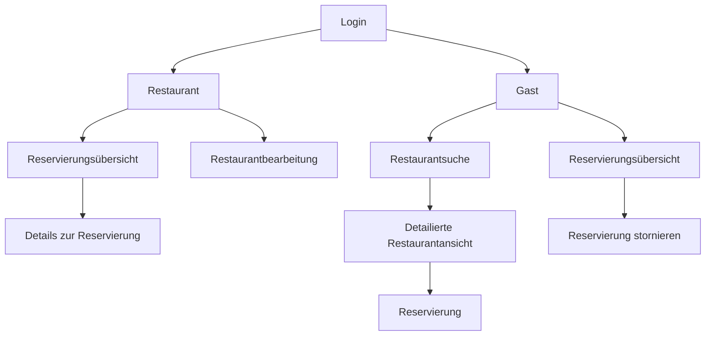

# Systembeschreibung

## Technologien

### Angular
Angular wird als Frontend verwendent. Dabei greift es auf die REST-Endpoints zu und ist für die gesammte Nutzerinteraktion zuständig.

### ASP.NET Core
Hier sind die REST-Endpoints implementiert bei dennen Daten aus der Datenbank geliefert werden oder neue Angelegt werden.

### Leocloud
Hier befindet sich unser Projekt, welches automatisch bei einem Merge auf dem Main-Branch aktualisiert wird.   
Dabei gibt es 2 Punkte:  
* Unser Angular-Projekt (https://student.cloud.htl-leonding.ac.at/s.raaber/onlinereservation/)
* Und das Backend mit RestEndpoints hierbei ist die Datenbank inkludiert

## Funktionalität
Am Anfang ist man bei einer Login-Seite, wo man sich Anmelden kann oder die Option hat ein neues Konto / Restaurant zu erstellen.   
Anschließend wird man entweder zur Kunden -oder Restaurantseite weitergeleitet.   

### Kunde
Hier kommt man zum Restaurantfilter, wo man nach Restaurant mit mehreren Optionen filtern kann (Name oder Bezirk, Ort, Datum, Uhrzeit, Essen). Hierbei wird der Name, Beschreibung und ein Bild des Restaurants angezeigt. Wenn man anschließend auf ein Restaurant klickt, kommt man zu einer genaueren Übersicht vom Restaurant (Bilder, Öffnungszeiten, Beschreibung, Arten des Essens (Italienisch, vegan, ...)). In dieser Ansicht kann man dann auch direkt reservieren.   
Man kann sich aber auch die eigenen Reservierungen anschauen und stornieren falls gewünscht. 

### Restaurant - Mitarbeiter / Besitzer
Hier wird man zur Übersicht vom eigenen Restaurant weitergeleitet. Dabei kann man reservierungen von Kunden anschauen, aber auch Daten vom Restaurant ändern. 

## Wichtigsten Funktionen
### Restaurantsuche
Hierbei werden die verschiedenen gegebenen Filter genommen und alle angewendet, wodurch wir eine Liste erhalten, mit der wir nur passende Restaurants erhalten. Aber wenn ein Restaurantname eingegeben wird, wird nur nach diesem gesucht und die andere Kriterien sind irrelevant.

### Reservierung
Bei der Reservierung muss man Datum mit Uhrzeit und Personenanzahl eingeben. Falls die Personenanzahl zu groß ist für einen Tisch, kann man eine Reservierung mit mehreren Tischen anfragen, diese muss dann aber vom Restaurant bestätigt werden. (Reservierung mit mehreren Tischen ist nur eine Erweiterung)